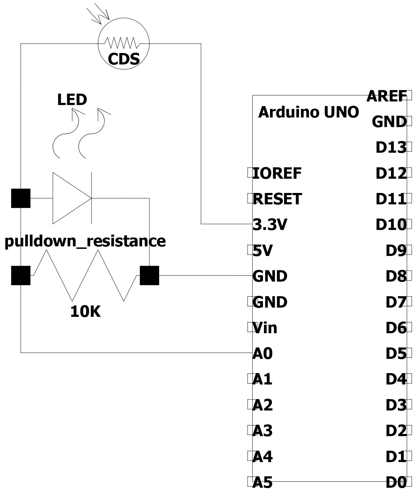

# CDS 조도 센서

## 필요 하드웨어
	- CDS(조도센서)
	- Arduino UNO
	- UNO cable
	- 10KΩ 저항
	- M-M cable(3ea)
	- 추가 선택사항
		- led(1ea)
		- M-M cable(2ea)

## 연결
	- LED는 cds값 변화를 눈으로 확인하기 좋게 사용하였을 뿐 필수는 아니며 본문에서는 LED사용을 위해 3.3V 전원을 인가했습니다.

## example_code.cpp 참고